# LOAD BALANCER SOLUTION WITH NGINX AND SSL/TLS

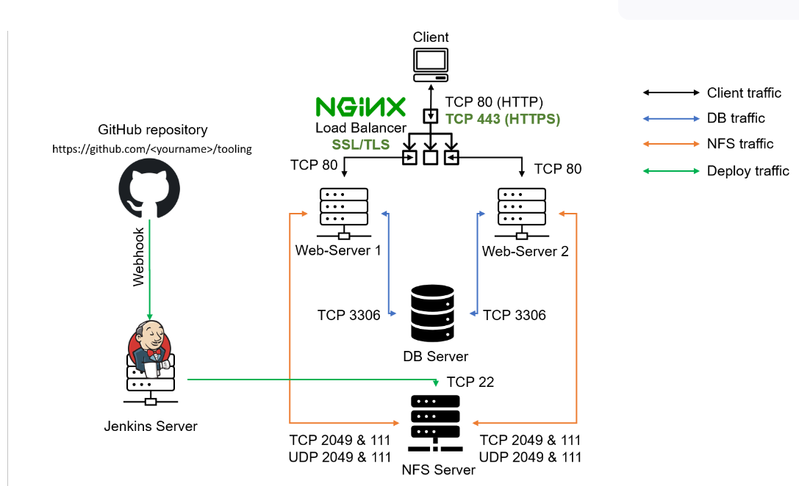

### create a domain name on hostinger > go to Route53 on AWS > create hosted zone > type in domain name created on Route53 > on the hostinger platform go to management then go to Name server > click on change and copy all Name Server in the hosted zone on Route53 into each line in hostinger Name server field > create an EC2 instance (ubuntu server 20.04 LTS) name it "Nginx LB" > create record for our domain name br copying the public IP of Nginx server > go to Route53 then click on create record > type the public IP into the value field in Route53 > click on create record on Route53 > in the record name field type www to create a record for 'www' in the value field type the public IP for our Nginx Loadbalancer

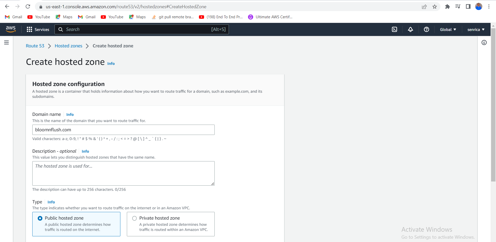

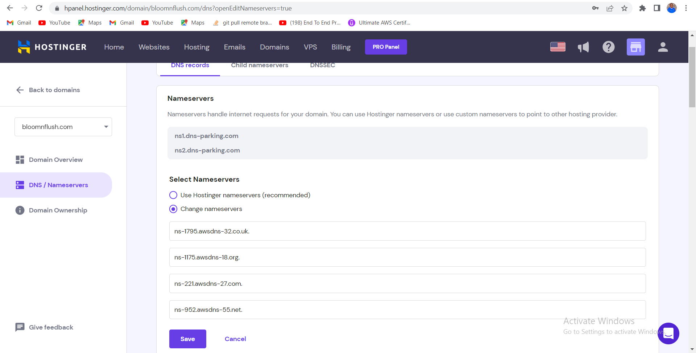

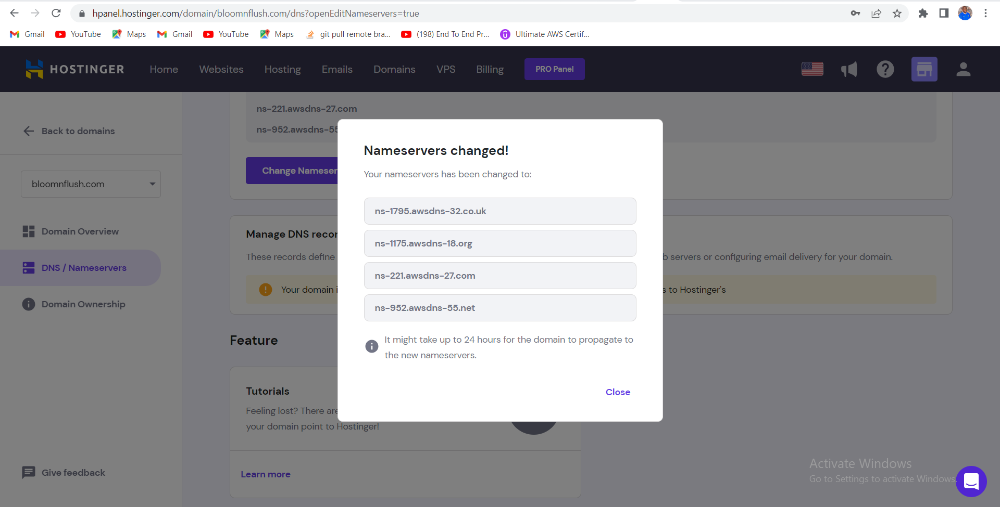

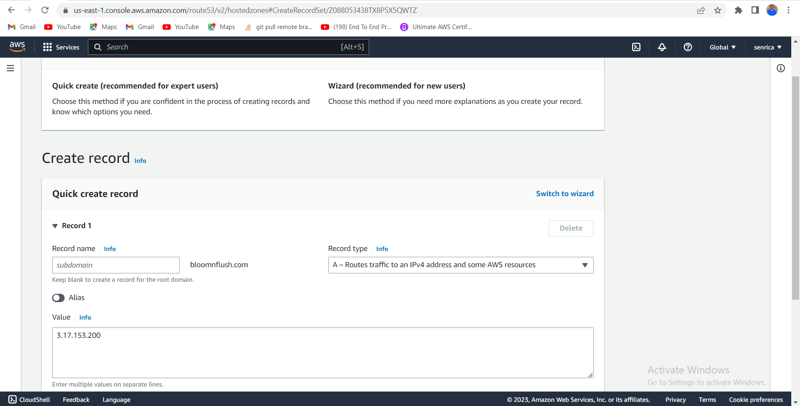

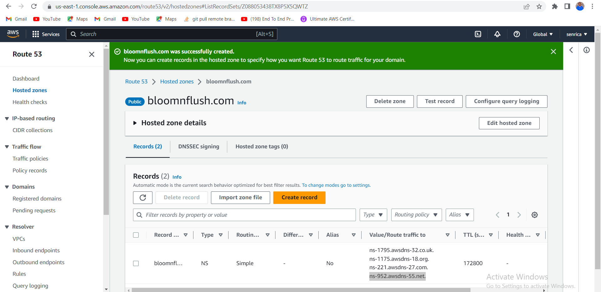

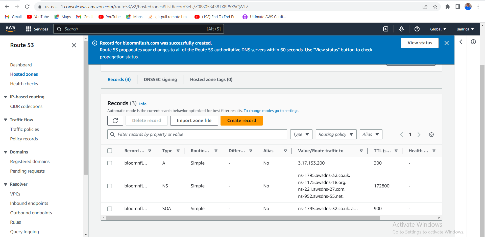

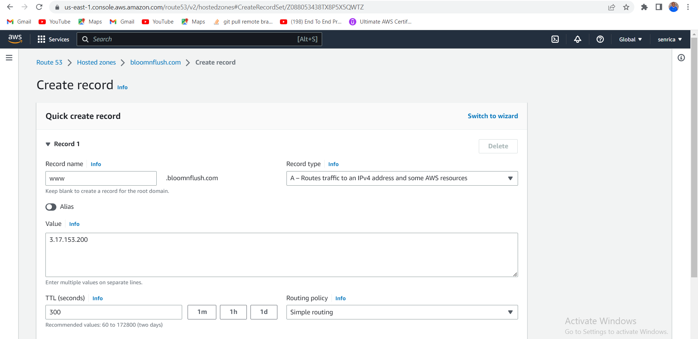

### update and install Nginx

`sudo apt update && sudo apt install nginx -y`

### Enabling and starting Nginx to start at boot time

`sudo systemctl enable nginx && sudo systemctl start nginx`

### checking Nginx status

`sudo systemctl status nginx`

### Open and update the default nginx configuration file paste the code (upstream myproject...) into the file

`sudo nano /etc/nginx/sites-available/load_balancer.conf`

`upstream myproject {
    server 18.118.160.190;
    server 18.217.107.26;
  }

server {
  server_name bloomnflush.com www.bloomnflush.com;

  location / {

    proxy_pass       http://myproject;
    proxy_set_header Host            $host;
    proxy_set_header X-Forwarded-For $remote_addr;
  }
}`

### To exit environment:  ctrl + o > enter > Y > ctrl + x

`sudo rm -f /etc/nginx/sites-enabled/default`

`sudo nginx -t`

`cd /etc/nginx/sites-enabled/`

`sudo ln -s ../sites-available/load_balancer.conf .`

`ls`

`ll`

### Checking that your Web Servers can be reached from your browser using new domain name using HTTP protocol

[checking if webservers can reach browser using http](http://www.bloomnflush.com)

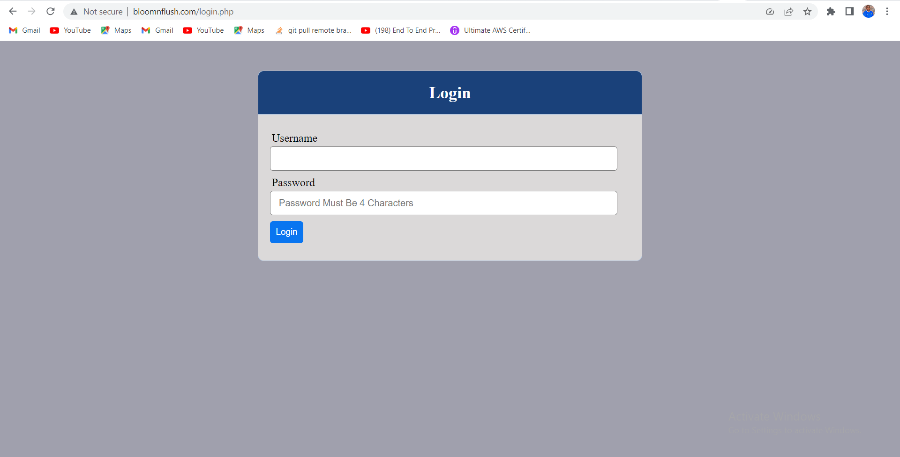

### Install certbot and request for an SSL/TLS certificate

`sudo apt install certbot -y`

### installing dependencies

`sudo apt install python3-certbot-nginx -y` 

### checking if our setting is correct

`sudo nginx -t && sudo nginx -s reload`

### registering our domain in certbot to acquire ssl/tls certificate

`sudo certbot --nginx -d bloomnflush.com -d www.bloomnflush.com`

### editing the crontab file and choosing the first option

`crontab -e`

### add the command below to the file

`* */12 * * *   root /usr/bin/certbot renew > /dev/null 2>&1` 

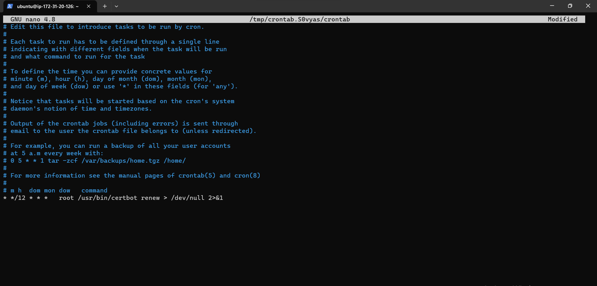

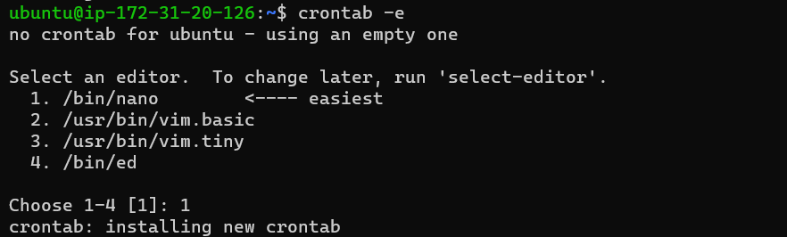

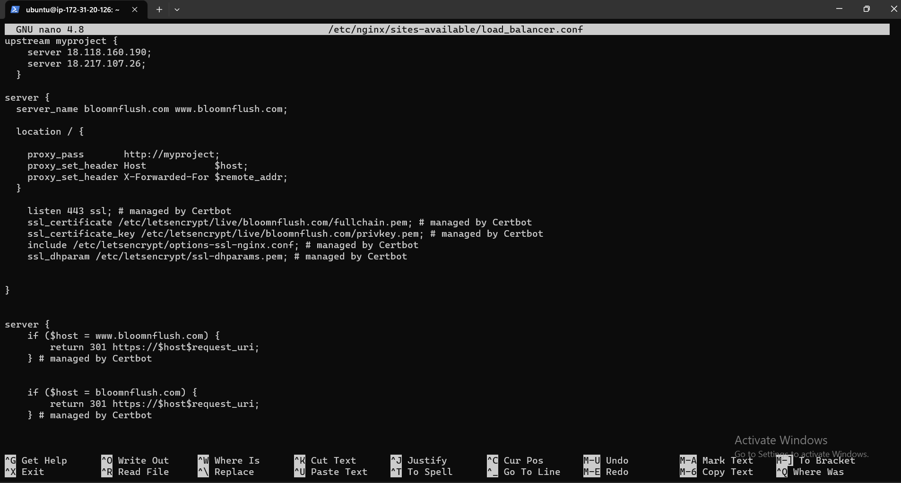